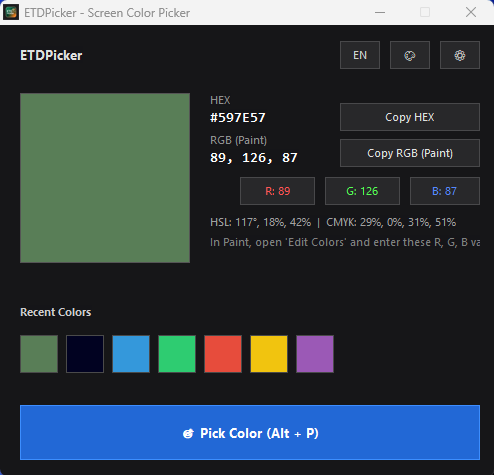
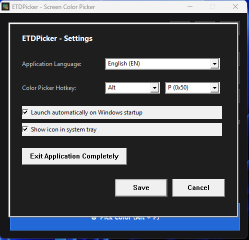
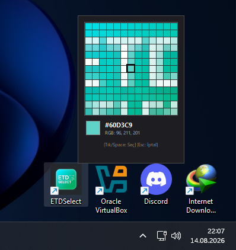

<div align="center">


# 🎯 ETDPicker
### Ultra-Lightweight Screen Color Picker for Windows
**Minimalist • Blazing Fast (<10 MB RAM) • Pure Native Win32 / Rust • Multi-Language**

[](https://www.rust-lang.org/)
[](https://microsoft.com/windows)
[]()
[]()
[](LICENSE)
[]()
[](https://github.com/emirtugra-dag/ETDPicker/releases)

---

[🇹🇷 **Türkçe Dokümantasyon**](#-türkçe) &nbsp;•&nbsp; [🇬🇧 **English Documentation**](#-english)

---

</div>

<br />

## 📸 Ekran Görüntüleri / Screenshots

<div align="center">
  <table>
    <tr>
      <td align="center"><b>🖥️ Ana Ekran (Main Window)</b></td>
      <td align="center"><b>⚙️ Ayarlar (Settings)</b></td>
      <td align="center"><b>🔍 Canlı Büyüteç (Pixel Magnifier)</b></td>
    </tr>
    <tr>
      <td></td>
      <td></td>
      <td></td>
    </tr>
  </table>
</div>

<br />

---

<a name="-türkçe"></a>
## 🇹🇷 Türkçe

**ETDPicker**, Windows işletim sistemleri için geliştirilmiş, ekranın herhangi bir noktasındaki rengi piksel hassasiyetiyle anında seçmenizi, HEX/RGB/HSL/CMYK formatlarında kopyalamanızı ve MS Paint, Adobe Photoshop, Figma veya web projelerinizde kolayca kullanmanızı sağlayan **ultra hafif ve yüksek performanslı** bir renk seçme aracıdır.

### 🌟 Öne Çıkan Özellikler

- ⚡ **Ultra Düşük Kaynak Kullanımı**: 10 MB'ın altında RAM tüketimi ile arka planda yokmuş gibi çalışır.
- 🔍 **Piksel Hassasiyetli Büyüteç (Magnifier)**: `Alt + P` kısayoluna bastığınızda imlecinizin etrafındaki alanı 8x büyüterek piksel piksel gösterir.
- 🎯 **Klavye İzolasyonu & Yön Tuşları Desteği**: Büyüteç açıkken yön tuşları (`↑`, `↓`, `←`, `→`) ile piksel piksel hassas kaydırma yapabilirsiniz. Tuşlar arkadaki pencerelere sızmaz.
- 🚀 **Otomatik Ön Planda Açılma**: Renk seçildiğinde (`Space` veya `Sol Tık`), ETDPicker diğer tüm pencerelerin en önüne odaklanarak anında açılır.
- 📋 **Otomatik Panoya Kopyalama**: Seçilen renk otomatik olarak HEX formatında (`#3498DB`) panonuza kopyalanır.
- 🔔 **Sistem Tepsisi (System Tray) Entegrasyonu**: Kapatıldığında arka planda çalışmaya devam eder. Tepsi simgesine sol tıklayarak açabilir veya sağ tıklayarak hızlı menüye erişebilirsiniz.
- 🎨 **Tüm Formatlar**: HEX, RGB, HSL, CMYK ve 10'lu dinamik geçmiş renk paleti.
- 🖌️ **Dahili MS Paint Rehberi**: Seçtiğiniz rengi Paint'e nasıl aktaracağınızı adım adım anlatan dahili kılavuz.
- 🌐 **İki Dil Desteği**: Türkçe ve İngilizce arayüz desteği.

### ⌨️ Kısayollar ve Kullanım

| Tuş | Eylem |
|---|---|
| <kbd>Alt</kbd> + <kbd>P</kbd> | Canlı Büyüteçli Renk Seçiciyi Başlatır |
| <kbd>Yön Tuşları (↑ ↓ ← →)</kbd> | İmleci 1 piksel hassasiyetle hareket ettirir |
| <kbd>Sol Tık</kbd> veya <kbd>Space</kbd> | Rengi seçer, panoya kopyalar ve ana ekranı açar |
| <kbd>Esc</kbd> | Renk seçimini iptal eder |

### 🎨 Paint ve Diğer Uygulamalarda Kullanım

1. `Alt + P` ile rengi seçin (Otomatik panoya kopyalanır).
2. MS Paint'i açın -> Üst menüden **Renkleri Düzenle (Edit Colors)** butonuna tıklayın.
3. Sağ alttaki **Kırmızı (R), Yeşil (G), Mavi (B)** kutularına ETDPicker'da gördüğünüz RGB değerlerini girin.
4. **Tamam**'a basarak rengi paletinize ekleyin ve hemen çizime başlayın!

---

<a name="-english"></a>
## 🇬🇧 English

**ETDPicker** is an **ultra-lightweight, high-performance** screen color picker built with pure Rust and native Win32 APIs for Windows 10 & 11. It allows you to pick any pixel color on your screen with precision loupe magnification and use it across Photoshop, Figma, MS Paint, and web projects.

### 🌟 Key Features

- ⚡ **Minimal Resource Footprint**: Consumes under 10 MB RAM and virtually 0% CPU.
- 🔍 **Pixel-Perfect Magnifier**: Press `Alt + P` to activate the live 8x pixel loupe.
- 🎯 **Isolated Keyboard Arrow Navigation**: Move the cursor pixel-by-pixel using arrow keys (`↑`, `↓`, `←`, `→`) without affecting background windows.
- 🚀 **True Foreground Activation**: After picking a color (`Space` or `Left Click`), the window is instantly brought to the true foreground in front of all open applications.
- 📋 **Auto Clipboard Copy**: Selected color is automatically copied to your clipboard in HEX format (`#3498DB`).
- 🔔 **System Tray Integration**: Stays responsive in the background when minimized/closed. Left-click to open or right-click for quick actions.
- 🎨 **Rich Formats**: Instant conversion to HEX, RGB, HSL, CMYK with a 10-slot dynamic recent palette.
- 🌐 **Multi-Language**: Full support for Turkish and English.

### ⌨️ Hotkeys & Controls

| Shortcut | Description |
|---|---|
| <kbd>Alt</kbd> + <kbd>P</kbd> | Activate live screen magnifier color picker |
| <kbd>Arrow Keys (↑ ↓ ← →)</kbd> | Move cursor by exactly 1 pixel |
| <kbd>Left Click</kbd> / <kbd>Space</kbd> | Pick color, copy to clipboard & restore main window |
| <kbd>Esc</kbd> | Cancel color picker |

---

## 📦 İndirme & Kurulum / Download & Installation

En son derlenmiş ve dijital olarak imzalanmış ikili dosyaları **[Releases](https://github.com/emirtugra-dag/ETDPicker/releases)** sayfasından indirebilirsiniz:

| Dosya / File | Tür / Type | Açıklama / Description |
|---|---|---|
| 🚀 **`ETDPicker_Portable.exe`** | Taşınabilir (Portable) | Kurulum gerektirmez. Tek tıkla çalışır, ayarları exe yanında saklar. |
| 📦 **`ETDPicker_Setup.exe`** | Kurulum Sihirbazı (Setup) | Başlat menüsü, masaüstü kısayolları ve başlangıç ayarlarını yapılandırır. |

---

## 🛠️ Kaynak Koddan Derleme / Building from Source

Gereksinimler: [Rust Toolchain (1.75+)](https://rustup.rs/) ve MinGW-w64 (GCC / Windres).

```bash
# Depoyu klonlayın / Clone the repository
git clone https://github.com/emirtugra-dag/ETDPicker.git
cd ETDPicker

# Taşınabilir sürümü derleyin / Build portable release
cargo build --release --package etd-picker

# Kurulum sihirbazını derleyin / Build installer release
cargo build --release --package etd-installer
```

---

## ⚖️ Lisans & Yasal Sorumluluk Reddi (License & Disclaimer)

- **Açık Kaynak Lisansı**: Kaynak kodlar **[MIT Lisansı](LICENSE)** kapsamındadır.
- **Fikri Mülkiyet**: **ETDPicker** proje ismi, logosu (`logo.jpg`) ve görsel kimliği **Emir Tuğra Dağ**'ın fikri mülkiyetidir.
- **Sorumluluk Reddi**: Bu yazılım "OLDUĞU GİBİ" (AS IS) sunulmaktadır. Yazılımın kullanımından doğabilecek her türlü durumdan kullanıcı mesuldür; geliştirici hiçbir hukuki veya cezai sorumluluk kabul etmez. Ayrıntılar için **[DISCLAIMER.md](DISCLAIMER.md)** dosyasını inceleyiniz.

---

<div align="center">
  <sub>Geliştirici: <b>Emir Tuğra Dağ</b> • Copyright © 2026</sub>
</div>
